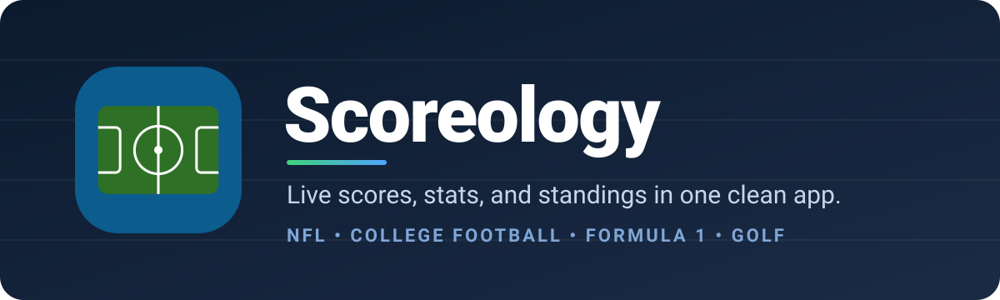
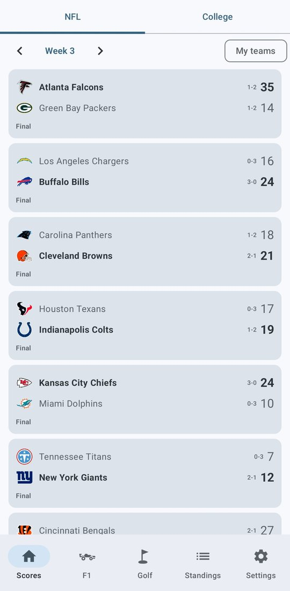
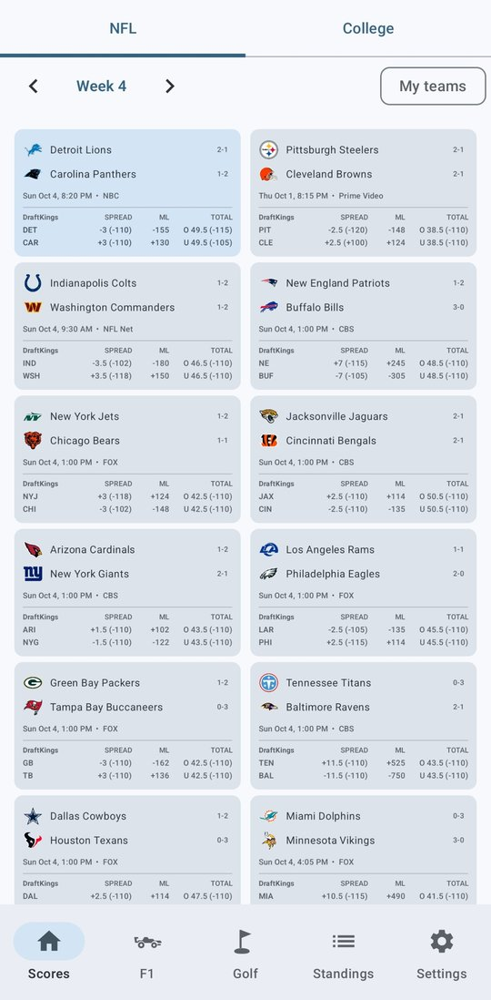
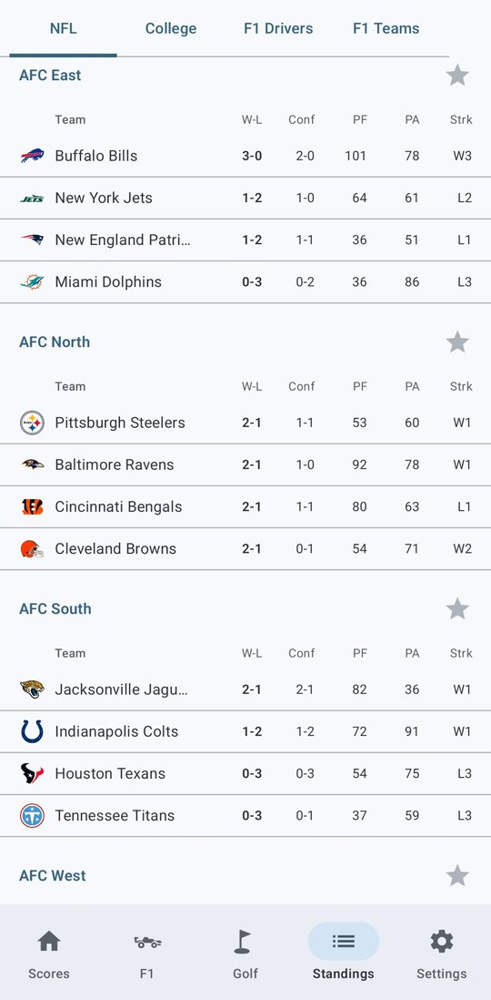
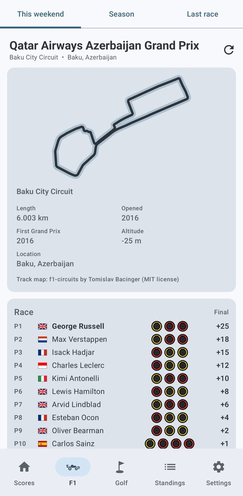
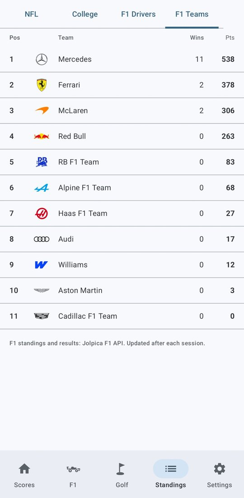
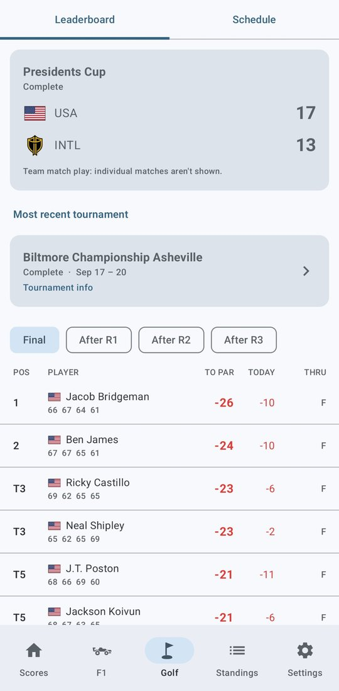

<p align="center">
  
</p>

<p align="center">
  <a href="https://github.com/Gozdor1234/Scoreology/releases/latest"></a>
  
  
  <a href="https://github.com/Gozdor1234/Scoreology/actions"></a>
</p>

<p align="center"><b>Every score, every stat, every standing. No ads, no clutter, no account.</b></p>

---

**Scoreology** is a fast, good-looking Android app that keeps you on top of the games you care about. Follow live NFL and college football scores, drill into box scores and player stats, catch every F1 session, and track the golf leaderboard shot by shot, all from one place and all updating on its own.

## ✨ Highlights

- **Live scores that keep up.** Games refresh every 30 seconds while they're live, with down and distance and a little 🏈 showing who has the ball. Pull down to refresh any time.
- **Game detail that goes deep.** Team stats, player stats, scoring plays, and drive-by-drive play-by-play, under a header that fades in each team's colors.
- **Tap anything.** Teams open to their schedule, stats, and roster. Players open to an overview, season and game-by-game stats, and a bio.
- **Your teams first.** Favorites float to the top, the "My teams" filter hides everything else, and notifications cover kickoffs, scores, and finals.
- **Built your way.** Themes include light, dark, AMOLED black, and your phone's own colors, plus a full custom palette. You can drag the tabs and bottom bar into whatever order you like.

## 📸 Screenshots

<table>
  <tr>
    <td align="center"><br><sub><b>Live scores</b></sub></td>
    <td align="center"><br><sub><b>Betting lines, two-column view</b></sub></td>
    <td align="center"><br><sub><b>NFL standings</b></sub></td>
  </tr>
  <tr>
    <td align="center"><br><sub><b>F1 weekend: track, tyres, points</b></sub></td>
    <td align="center"><br><sub><b>F1 team standings</b></sub></td>
    <td align="center"><br><sub><b>Golf leaderboard</b></sub></td>
  </tr>
</table>

## 🏟️ What's inside

| | |
|---|---|
| 🏈 **Scores** | NFL and college football by week. College can show Top 25, all FBS, or one conference, and you can pin a favorite conference. Pinch to zoom, with two columns when fully zoomed out. |
| 💰 **Betting lines** | Moneyline, spread, and over/under on upcoming games. Lines come from FanDuel if you add a free Odds API key, otherwise DraftKings. |
| 📊 **Standings** | NFL divisions, college conferences, and F1 driver and constructor championships. |
| 🏎️ **Formula 1** | Race weekend sessions (newest first), a circuit card with a track map and details, and full results from the last race. |
| ⛳ **Golf** | Live PGA TOUR leaderboard, the season schedule, round-by-round standings, hole-by-hole scorecards, and golfer season stats. |
| 📱 **Home-screen widget** | Your games at a glance without opening the app. |
| 🎨 **Appearance** | System, light, dark (gray-blue), AMOLED, dynamic phone colors, and a custom color palette with brightness control. |

## 📲 Install it

1. On your Android phone, open the **[latest release](https://github.com/Gozdor1234/Scoreology/releases/latest)**.
2. Tap the **`Scoreology-N.apk`** file to download it, then open it.
3. If Android asks, allow **Install unknown apps** for your browser or Files app.
4. If Play Protect warns about an unrecognized developer, tap **Install anyway**. This happens with any app that isn't from the Play Store.

**Updating:** install the newer APK right over the old one. Your favorites and settings carry over.

> 💡 **Tip:** For timely alerts, set the app's battery usage to **Unrestricted** (Settings > Apps > Scoreology > Battery). Android checks for alerts about every 15 minutes, and it can wait longer than that while the phone is idle.

## 🔌 Where the data comes from

| Source | Used for |
|---|---|
| ESPN public endpoints | NFL and college scores, box scores, play-by-play, teams, players, standings, golf, and the DraftKings lines |
| [Jolpica F1](https://github.com/jolpica/jolpica-f1) | F1 results and championship standings |
| [The Odds API](https://the-odds-api.com/) (optional) | FanDuel lines, using your own free key |
| [f1-circuits](https://github.com/bacinger/f1-circuits) (MIT) | F1 track maps |

The ESPN endpoints are public but undocumented, so ESPN can change them without warning. If a screen suddenly says "Couldn't load data," that's usually why, and the parser needs a small fix.

## 🛠️ Under the hood

- **Language and UI:** Kotlin 2.0 and Jetpack Compose (Material 3)
- **Libraries:** Coil for images and WorkManager for background alerts
- **Android versions:** minSdk 26 (Android 8.0), targetSdk 34
- **Builds:** every push to `main` builds a signed APK with **GitHub Actions** (`.github/workflows/build-apk.yml`) and publishes it as a release. No local Android setup needed.
- **Polling:** data only refreshes while the app is on screen, so it's light on battery.

<details>
<summary><b>Project layout</b></summary>

```
app/src/main/java/com/nate/scoreline/
  MainActivity.kt        Navigation, tabs, and back stack
  UiCommon.kt            Theme, lifecycle-aware polling, shared components
  ScoresScreen.kt        Weekly scoreboard, pinch zoom, pull to refresh
  GameDetailScreen.kt    Box score, players, scoring, play-by-play
  TeamScreen.kt          Team schedule, stats, roster
  PlayerScreen.kt        Player overview, stats, bio
  StandingsScreen.kt     NFL, college, and F1 standings
  F1Screen.kt / F1.kt / Circuits.kt     F1 weekend, results, circuit maps
  GolfScreen.kt / GolfData.kt           Leaderboard, schedule, scorecards
  OddsData.kt / OddsRepo.kt / OddsUi.kt Betting lines
  Espn.kt / TeamData.kt  ESPN parsers
  Alerts.kt / AlertLogic.kt             Notifications
  ScoresWidget.kt / WidgetFormat.kt     Home-screen widget
  Favorites.kt           Saved favorites and settings
  SettingsScreen.kt / ThemeColors.kt / ColorPicker.kt   Settings and theming
  NavBar.kt / ReorderableTabs.kt        Drag-to-reorder bars
  Net.kt                 HTTP and JSON helpers
```

</details>

## ⚠️ Notes

- Scoreology is a personal hobby project. It isn't affiliated with or endorsed by ESPN, the NFL, the NCAA, Formula 1, the PGA TOUR, FanDuel, or DraftKings. All team names and logos belong to their owners.
- The APK signing key lives in this repo so the automated builds can sign updates. That's convenient, but anyone with the key could sign an APK that installs as an "update," so only install Scoreology from this repo's Releases page.

---

<p align="center">Made with ☕ and a lot of Sundays.</p>
